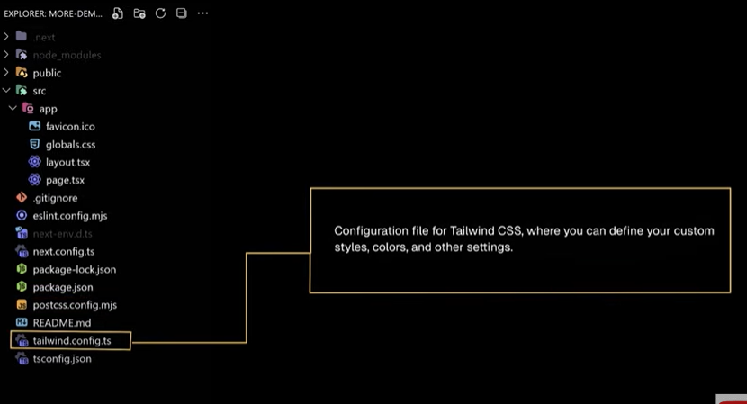

# Next-js

- Next.js is a popular open-source React framework that makes it easier to build fast and scalable web applications. It provides a lot of built-in features like SSR, SSG, API routes, and automatic code splitting, all of which help with performance and SEO.

# Fallbacks of React.js

# Merits of Next.js

# Create Next.js App

- npm run dev : to run the server ->  http://localhost:3000

# Next.js Folder Structure

1. /.next

2. /node_modules

3. /public

4. /src

5. .gitignore

6. eslint.config.mjs

7. next.env.d.ts

8. next.config.ts

9. package-lock.json

10. package.json

11. postcss.config.mjs

12. tailwind.config.ts

13. tsconfig.json

# Routing files

1. page.tsx -> you can't change the name.

# Exercise: Basic Routing in Next.js
The goal Of this exercise is to create a simple Next.js application with multiple pages and implement basic routing using
Nextjs built-in routing system.
Instructions:
1. Create a new Next.js project.
2. Create two routes named "about" and "contact".
3. Verify that you can navigate between the "about" and "contact" pages.

# Linking and Navigating

# COMPLETED DASHBOARD PROJECT

# Exercise: Nested Routes in Next.js
The goal of this exercise is to demonstrate understanding of how to create nested routes in a Next.js application,
Instructions:
1. Create a "products- route and inside that same folder create two more folders name "allproducts• &
"specificproduct-
2. Inside the "allproducts- folder create a component which will show this text: -(1220) products in the store"
3. Inside the "specificproduct" folder Create a Component which will show this text: "Here is my one & only product"

 
 # Redirecting 
 

#Exercise: Linking and Navigation in Next.js
The goal Of this exercise is to practice using Next.js•s component for client-side navigation in a Next.js
application.
Instructions:
1. Create two routes "home" and "dashboard"
2. In the "home" route, create a simple landing page with a welcoming message and some content.
3. In the "dashboard" page, create a dashboard with various components, such as a navigation menu, user profile, and
other related information.
4. In the "dashboard" route, implement a navigation menu that includes links to the "home- page and other sections
within the dashboard.
5. Use Next.js's <Link> component to create these navigation links. Ensure that clicking on these links navigates the
user to the corresponding pages within the application without a full page refresh.

